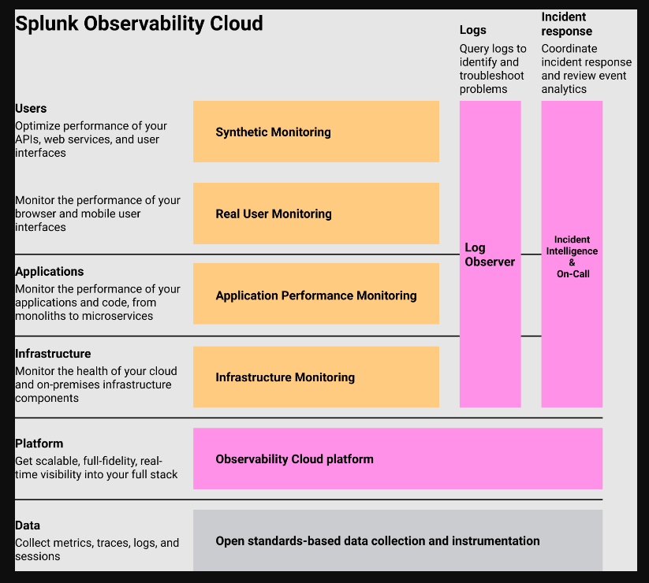

# Splunk-O11Y
Study notes for the Splunk Observability Beta Exam March 2023
<h2>****All information comes directly from the <a href="https://docs.splunk.com/Observability/get-started/welcome.html#nav-Welcome-to-Splunk-Observability-Cloud"> Splunk documentation</a>*****</h2>

<h1>Intro to Splunk Observability</h1>
<h3>Monitoring and Observability</h3>

<ul>
<li><strong>Monitoring</strong> - analyse and understand the data about the health and performance of your system</li>
<li>Observability - quality of software services, platforms, and products that allow you to understand how systems are behaving. Makes investigating and disagnosing problems easier.</li>
<li><strong>Why Use Observability?</strong> User experience, Improve incident response, KPIs and other business metrics, improve engineer agility</li>
<li>"Keeping an eye on things"</li>
<li>Problems are identified based on expected behavior of factors</li>
</ul>

<h3>Characteristics of an Observable System</h3>

<ol>
<li>Data Collection</li>
<li>Data visualization</li>
<li>Problem Detection</li>
<li>Data Exploration and Correlation</li>
<li>Remediation</li>
</ol>

<h3>Challenges</h3>

<ul>
<li>Tool Sprawl - Time spent procuring multiple tools</li>
<li>Missing Data - sampling and non-granular</li>
<li>Scale - degradation and long delays in cloud environments</li>
<li>Slow Alerts</li>
<li>Limited Analytics - data from multiple tools</li>
</ul>

<h3>Getting Data In</h3>

<ul>
<li>You can send data to Splunk O11Y using the Open Telementry Collector to connect to cloud services such as AWS, GCP or Azure.</li>
<li>You can send business related metrics from your apps such as the # of API calls or number of logins</li>
<li>You must be an admin to configure some of the integrations</li>
<li>Select the Navigation menu > Data Management. Click New Integration. Follow the steps in the wizard</li>
</ul>

<h3>Splunk Observability Cloud</h3>

Splunk O11y provides a seamless workflow for your DevOps teams and developers to easily monitor, troubleshoot and investigate issues with your infrastructure, apps and services.

Start from Splunk RUM(frontend traces) to Splunk APM(backend traces)

<h3>Splunk IM</h3>

<ul>
<li>Provides a simple and comprehensive platform to monitor and troubleshoot your infrastructure and apps</li>
<li>Built-In Content</li>
<li>Custom Dashboards</li>
<li>Detectors for Alerting</li>
<li></li>
</ul>

<h3>Splunk APM</h3>
<ul>

<li>Monitors cloud-native, microservices-based apps by collecting traces. A <strong>trace</strong> is a collection of actions (known as spans) that occur to complete a transaction. Splunk APM collects and analyzes every span and trace that is generated by the instrumentation</li>
<li>APM overview page tells you which services or business flows have the highest error rate</li>
<li>Explore further on this page. See a service map of all services</li>
<li>Tag Spotlight - analyze performance of your services to discover trends</li>
<li>Traces shows you a list of exemplar traces, click on any trace to see details</li>
<li>AlwaysOn Profiling collects stack traces so that you can discover lines in code that are slowing down or crashing systems to reduce MTTR</li>
<li>Memory profiling adds memory allocation data to stack traces and exposes JVM memory metrics. Discover leaks and unusual consumption patterns</li>
<li></li>
</ul>

<h3>Splunk Log Observer</h3>
<ul>

<li>Perform code-less queries on your logs to find the source of your problems</li>
<li>Timeline - gives you a quick overview of the health of your system. Drill down on particular severity by clicking the desired severity and adding it to the filter</li>
<li>Logs Table - Displays logs as they are streaming in the most recent logs appearing at the top. Filters applied to the Timeline, are also applied to the logs in the log table</li>
<li>Live Tail - Observe changes in your system in real time. Provides near real time view of your logs as they stream into Log Observer</li>
</ul>

<h3>Splunk Real User Monitoring (RUM)</h3>
<ul>

<li>Monitors the performance and health of the front-end UX. </li>
<li>Collects metrics, web vitals, errors and other forms of data</li>
<li>To monitor only browser traces from your app, install Splunk RUM. To montior you app from browser to back-end, use Splunk RUM with Splunk APM</li>
</ul>

<h3>Splunk Syntheric Monitoring</h3>
<ul>

<li>Visibility into your UX.</li>
<li>Run tests in pre-production environments to run performance tests during the software development process, fix any issues with content before they impact real users on your production website</li>
</ul>

<h3>Splunk On-call</h3>

<ul>
<li>Used to automate your incident response and reduce MTTR.</li>
<li>Collaborate with others to troubleshoot issues and enable your team to conduct post-incident reviews to improve processes.</li>
</ul>

<h3>Enterprise Features</h3>

  <ul>
    <li>Mirrored Dashboards - allow you to add the same dashboards to multiple groups or multiple times to the same dashboard group. You can edit a dashboard and any changes made to it are visible in all mirrors. Follow team member changes, creating dashboards for multiple teams, support multiple filters for each team.</li>
<li>Dashboard group write permissions to add overrides on a mirror.</li>
<li>Permissions is an Enterprise feature. Restrict who can make changes to the dashboard <strong>BEFORE</strong> you create any mirrors.</li>
    <li>Filter and dashboard variable options are stored with the mirror in the current group.</li>
    <li>Delete mirrors by going to the dashboard actions and selection "Remove this Mirror"</li>
    <li>To delete, edit or move charts, you do need dashboard permissions. To delete a mirror from a group or change and edit from a group, you need group permissions. </li>
    <li>To edit a mirror or delete - dashboard permissions, to add a dashboard mirror to a group or change the value for a mirrored dashboard - group permissions</li>
    <li>The default permissions for a user: any user can edit dashboards and dashboard groups or detectors. Read permissions: new dashboards and dashboard groups can be viewed by any user. You can limit who can see your dashboards and groups by specifying read permissions. Write permissions: can be set on dashboards, groups and detectors: by default, everyone can edit dashboard groups, inherit permissions from the dashboard group to which it is saved. Everyone can edit detectors.</li>
    <li>Built in dashboards cannot be edited. You must do a "save as" and copy in order to edit it.</li>
    <li>Anyone who has write permissions can: grant write permissions to users and teams, has read permissions for the same item, grant or revoke all permissions for an item. Admins can grant and revoke write permissions for any item.</li>
    <li>Detector Write Permissions </li>
    <li>Remove users/Teams by clicking the "X" next to their name.</li>
    <li>Requesting permissions - if permissions have been set, you will need to request permission from users who have write permissions</li>
    <li>Restricting Access for teams in "General Settings" check the box "Restrict Access"</li>
    <li><strong>Administrators</strong>: add and remove users from the org, and grant admin permissions to users. Create/edit teams, Join or leave teams, Add members to an empty team, Elevate members whose access is restricted.</li>
     <li><strong>Team Manager</strong>: Only available if "restrict access" is enabled. Cannot create or delete teams. Can add members to teams and edit teams, manage team notifications</li>
     <li><strong>Org Members</strong>: Users without admin privileges. Join and leave teams. Edit team. Link content to teams. Cannot add or manage members.</li>
    </ul>

    
 <h3>Getting Data In</h3>

  <ul>
    <li></li>
<li></li>
<li></li>
    </ul>

    
<h3></h3>

  <ul>
    <li></li>
<li></li>
<li></li>
    </ul>

    

<h3></h3>

  <ul>
    <li></li>
<li></li>
<li></li>
    </ul>

